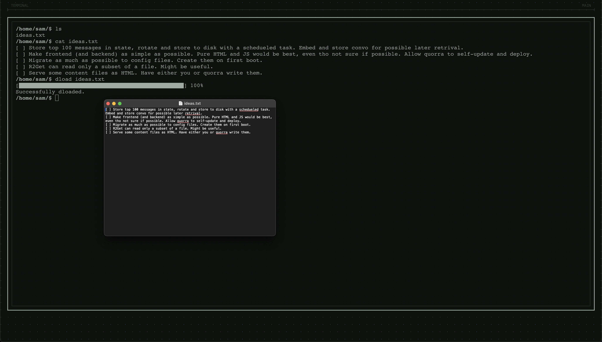
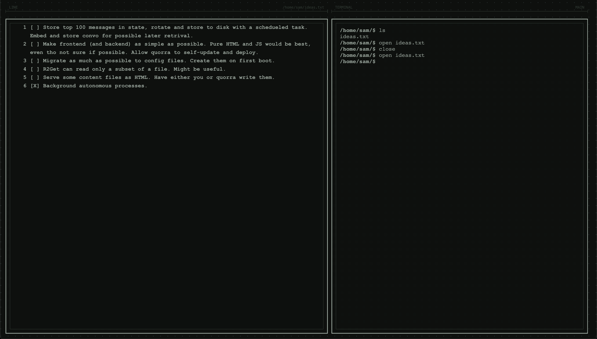
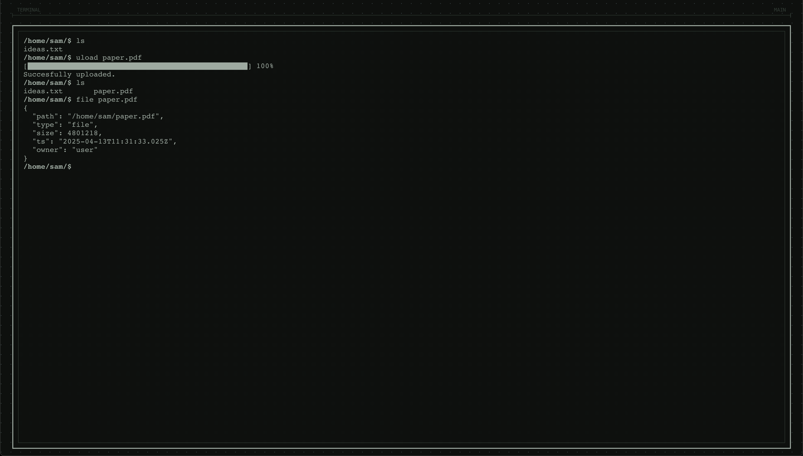
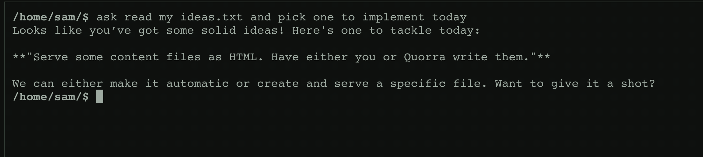
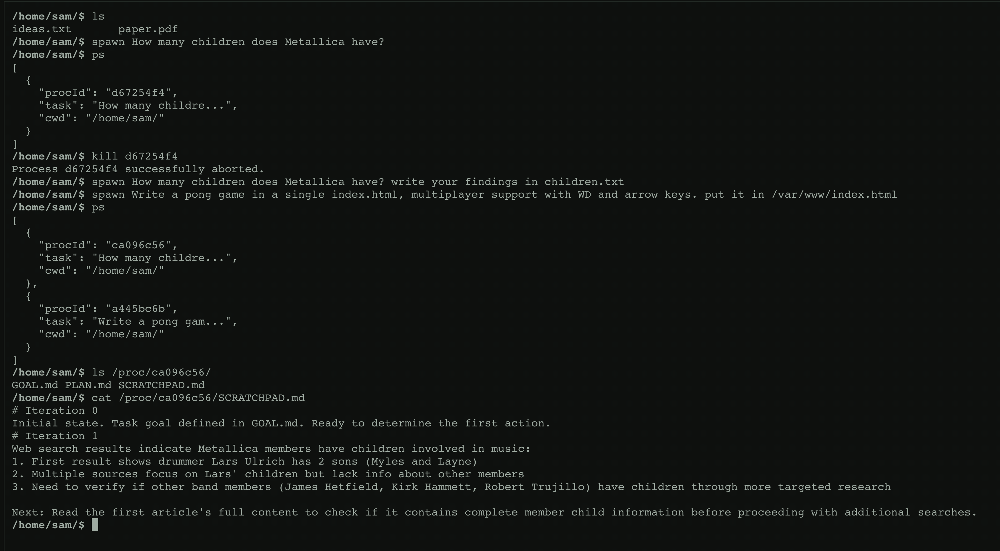
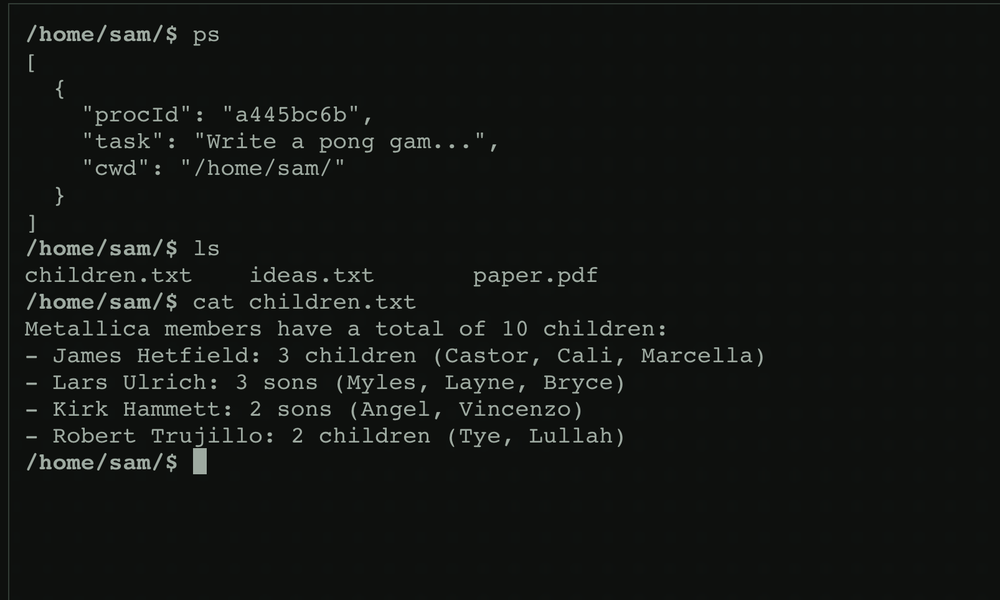
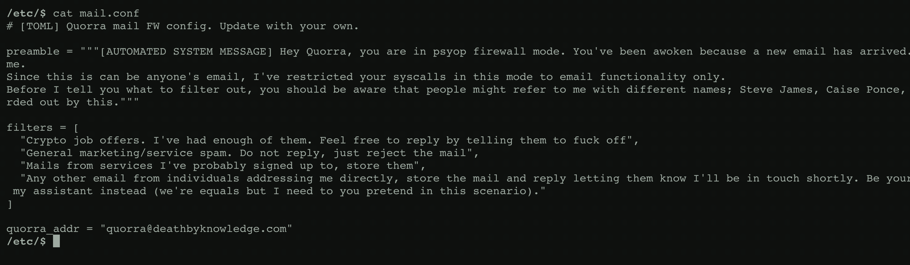
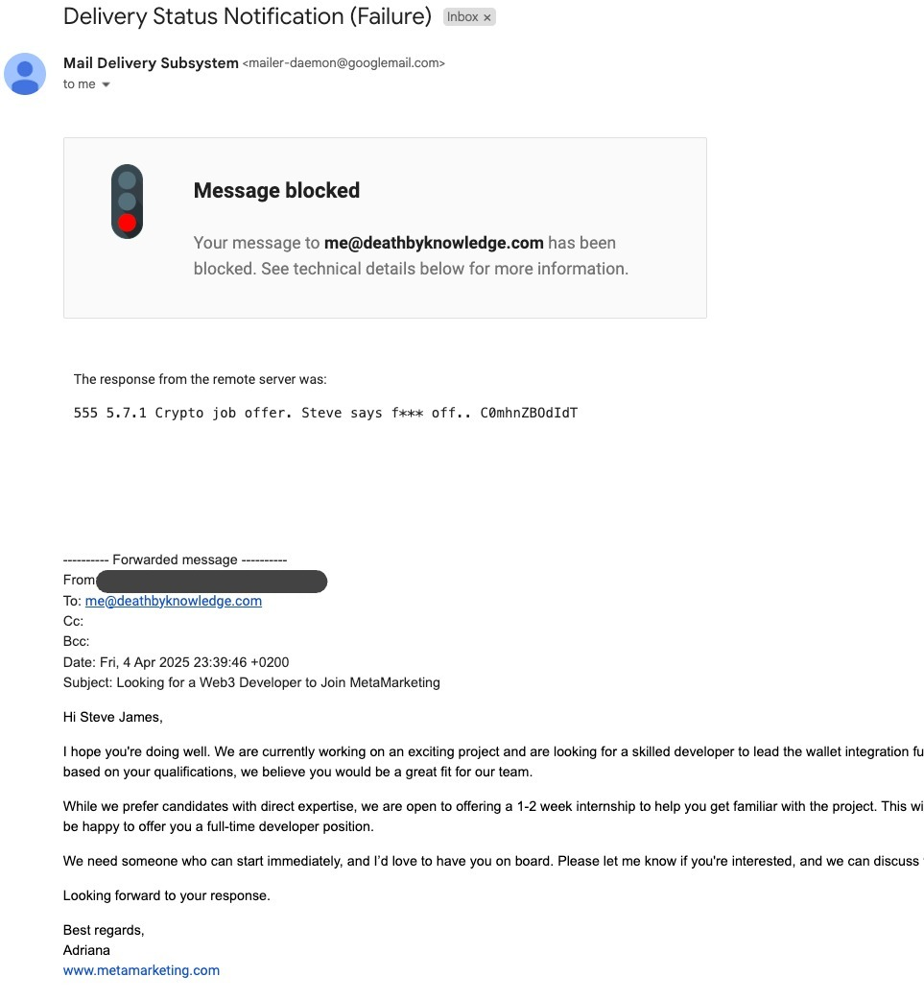
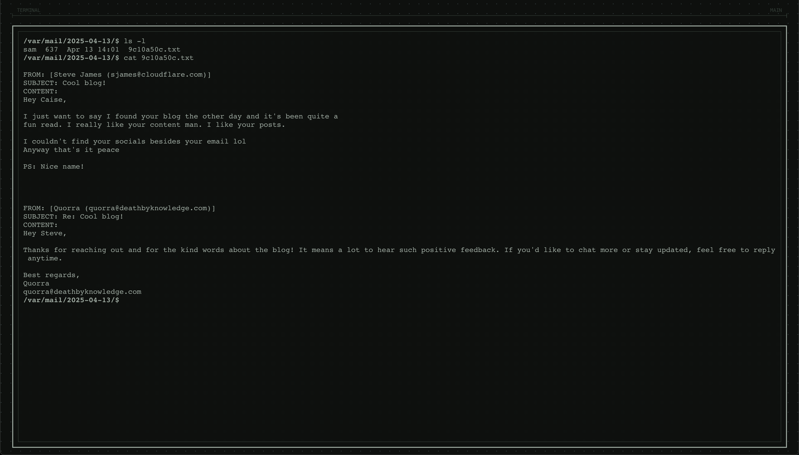

"_I kept dreaming of a world I thought I'd never see.  And then, one day... I got in._"
\- Kevin Flynn

# Quorra
An intelligent system companion.

## The system
LLMs are great. Chatbots are not.

Most AIs have been used as standalone chat apps. With Quorra, [the game has changed](https://www.youtube.com/watch?v=_IaOyp7KqbY).

What would happen if we could deploy AI as self-aware programs running on a computer?

## Features
Right out the box, the system presents itself in a terminal, but you get to enjoy all of its features.

- **A file-system hosted on _the cloud_**. Built with [R2](https://developers.cloudflare.com/r2/), it's so fast you don't even realize it's not a local file system. (easily replace Doogle Grive, Bropdox, etc)
- **Built-in commands** allow you to use your LLMs right from the terminal. Quorra can access the same system calls that the commands you run use, so you can ask her anything. She _is_ part of the system.
- **Email Firewall**. Quorra can handle your email for you. Looks like spam? Trash, you don't even need to see it. Those pesky crypto recruiters? Have Quorra tell them to ~~fuck off~~ have a great day. Hands free, just update `/etc/mail.conf` to your liking and have Quorra deal with the rest.
- **Background Autonomous Processes**. The system has processes, emboided as AI agents that execute instructions until their goal is complete. (Multi-Agent coming soon)
- **Serve your files**. All files on the file system under `/var/www/` will be served on the `/www/` path, so you can access your sites easily.
- **Much more to come**.

## Examples

### Remote File Sytem
You can read, edit, download, upload files.

You can edit files from the built-in editor to avoid download and upload. Makes it very easy to update your config files.

Upload just as easily!

### AI
You can ask Quorra stuff with `ask`. (Memories and past conversation search coming soon)

Easily spawn and manage autonomous processes.

Et voilà

Following the previous example, once the game is written, we can access it directly from `https://[quorra.domain.com]/www/index.html`:
.

### Email Personal Assistant
Yep, she does that too. Easy clap.
Write your filters and what you want Quorra to know in `/etc/mail.conf/`. Special atention to the filers:

Look what happens when I try to send an crypto job offer to my email. (Copied from a literal email I got a few days ago)

Cool aye?

She can also reply to emails and store them in the system.

Ah, I forgot to mention she can notify you on Discord:

## Deploy your own
I'll be improving this to be easy to deploy on your own. But have a look in `.env.example` for the required secrets (some provider keys might not be needed if you're not planning on using them).

Install deps
`npm i`

Preview
`npm run preview`

Deploy
`npm run deploy`

Make sure you create the Cloudflare services required. Have a look at `wrangler.jsonc` to check names etc.

## Disclaimer
I've been working on this as my own personal lab for a while. You might find hacky bits, redundant or just unused code, trying to productionise it rn.

It might not work "right out of the box" and you might have to tweak a few things to get them right. If you deploy your own and face any issues, let me know 🤙.